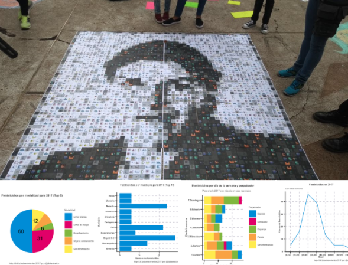

Rosa Elvira, 35, was found at around 5am after she called the emergency line in a park at the heart of Bogota, Colombia. She was still alive when she was taken at around 7am to the hospital. She was raped, stabbed, strangled, and her guts were destroyed by branches that were forced through her vagina and anus. 

This happened in 2012. It is because of this horrific episode that we now have a law of feminicides in Colombia. However, there is still a long way to fight violence against women. This is why we made this tribute to Rosa Elvira, using the sad numbers of those women that were killed 5 years later in Colombia only because they are women.

For more details on how we built the Mosaic with graphs see the ** english version bellow **

# Homenaje a Rosa Elvira Cely

Rosa Elvira, 35, fue encontrada a las 5am después de llamar al 123 de la policía en el Parque Nacional en el corazon de Bogotá. Todavía estaba viva cuando la encontraron y la llevaron al hospital a las 7am. Rosa Elvira fue violada, apuñalada, ahorcada y empalada. Sus entrañas destrozadas por palos introducidos por su vagina y ano.

Esto ocurrió en 2012. Es por este terrible episodio que tenemos en Colombia la Ley de Feminicidios. Pero desafortunadamente eso no es suficiente. Aún después de 5 años siguen matando mujeres solo por ser mujer. Es por eso que hicimos este homenaje a Rosa Elvira utilizando las cifras detrás de los feminicidios de 2017, cifras que no muchos están contando.

Esta es Rosa Elvira

Y esta es Rosa Elvira creada dibujada con los datos de feminicidios en Colombia durante 2017.

Los datos los recopilamos para el [especial sobre violencia contra la mujer](http://especiales.datasketch.co/sobrevivientes). 

Puedes ver todas las imágenes en el collage [aquí](especiales.datasketch.co/sobrevivientes/caminos-para-combatir-la-violencia.html), se muestran datos de feminicidios por días de la semana, meses, perpetrados, armas utilizadas, etc.

## Cómo lo hicimos

Nos inspiramos en el trabajo de RLadies Lucy D'Agostino McGowan [@LucyStats](http://twitter.com/LucyStats) y Maëlle Salmon [@ma_salmon](http://twitter.com/ma_salmon) en el que hicieron un [collage de R Ladies](http://livefreeordichotomize.com/2017/07/18/the-making-of-we-r-ladies/) con imágenes de perfil de twitter.

Decidimos hacer lo propio, solo que en lugar de usar imágenes existentes, decidimos crear las imágenes a partir de los datos de feminicidios en Colombia en 2017 usando ggplot. Creamos más de 60 gráficos diferentes para explorar (puedes ver los gráficos en la carpeta [/srcimgs_original](./srcimgs_original))

Con los gráficos hechos debíamos encontrar una forma de generar diferentes escalas de grises para tener el resultado final. Una opción era usar diferentes temas de ggplot al azar, pero como usaríamos los gráficos de ggplot en diferentes partes del proyecto decidimos usar el paquete [magick](https://cran.r-project.org/web/packages/magick/vignettes/intro.html) de procesamiento de imágenes para hacer muestreos de diferentes tonalidades de grises con 6 niveles para representar aproximadamente la distibución de los pixeles de la imagen objetivo. 

Finalmente se utiliza el paquete [RsimMosaic](https://cran.r-project.org/web/packages/RsimMosaic/index.html) para generar el mosaico.

Este es el resultado final.
Para conocer más sobre la intervención que hicimos con estos datos puedes ver este [post](https://www.datasketch.co/es/p/revive-nuestra-intervencion-callejera-con-rosa-elvira-cely).
Y para replicarlo puedes revisar el [script](rcompose-image.R) para generar el mosaico.

_ENGLISH_

# Tribute to Rosa Elvira Cely

Rosa Elvira was recreated with the numbers of feminicides in Colombia in 2017.

We gathered the data manually for out [special report on violence against women in Colombia](http://especiales.datasketch.co/sobrevivientes). If you read spanish please do take a look at it.

All images for the mosaic can be seen [here](especiales.datasketch.co/sobrevivientes/caminos-para-combatir-la-violencia.html). There are different graphs on feminicides by week day, relationship with the perpetrator, weapons used, and so on.

## How we build the collage

We got the inspiration from Lucy D'Agostino McGowan [@LucyStats](http://twitter.com/LucyStats) and Maëlle Salmon [@ma_salmon](http://twitter.com/ma_salmon). They made a [collage of R Ladies](http://livefreeordichotomize.com/2017/07/18/the-making-of-we-r-ladies/) with profile images.

We decided to do the same but instead of using existing images we created our own with ggplots from the data we collected on feminicides in Colombia during 2017. We created more than 60 different ggplots to explore the data from multiple angles (you can check the original graphs here [/srcimgs_original](./srcimgs_original))

With graphs for the mosaic done, we need a way to transform them so each graph would correspond to a pixel in the final image. For the final image to have better results we would need to map adjust the brightness of each ggplot so they would resemble a pixel value in a gray scale image. One option was to use different ggplot themes randomly, but given that we would use the graphs for something else we decided to change the brightness and saturation values of each image using [magick](https://cran.r-project.org/web/packages/magick/vignettes/intro.html). We did this randomly for 6 different "levels of gray". 

Finally we used the awesome [RsimMosaic](https://cran.r-project.org/web/packages/RsimMosaic/index.html) to generate the mosaic. By the way, [@LucyStats](http://twitter.com/LucyStats) we couldn't make your adaptation to work, we were having issues with gray scale images. 

Anyway, to know more about the intervention and how we ended up using this to create impact in the real world check this [post](https://www.datasketch.co/en/p/how-we-used-r-to-raise-alarms-about-feminicides-in-colombia).
And to replicate the mosaic simply check the [script](rcompose-image.R).

**Warning**
There are large images in this repo.

All this content is [CC-BY-SA internacional license](https://creativecommons.org/licenses/by-sa/4.0/).
Please do reference our post or site at http://datasketch.co or http://jpmarindiaz.com

